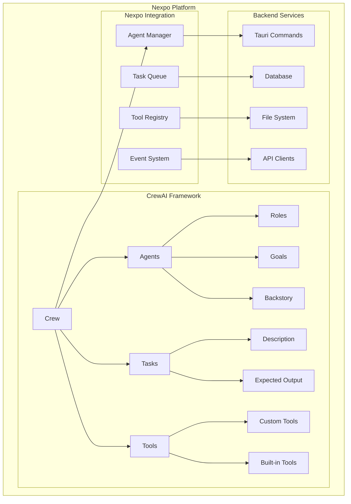

# CrewAI Integration with Nexpo

## Overview

CrewAI is a powerful multi-agent framework that enables the creation of collaborative AI agents working together to solve complex tasks. In the Nexpo ecosystem, CrewAI provides the foundation for building intelligent agent systems that can handle distributed workflows, collaborative problem-solving, and autonomous task execution across various domains.

## Architecture

### CrewAI Core Components



## Installation and Setup

### Dependencies

```toml
# Cargo.toml
[dependencies]
crewai = "0.1.0"
tokio = { version = "1.0", features = ["full"] }
serde = { version = "1.0", features = ["derive"] }
tauri = { version = "1.0", features = ["api-all"] }
uuid = { version = "1.0", features = ["v4"] }
chrono = { version = "0.4", features = ["serde"] }
```

```toml
# pyproject.toml
[tool.uv.dependencies]
crewai = "^0.28.0"
crewai-tools = "^0.1.6"
langchain = "^0.1.0"
langchain-openai = "^0.0.8"
pydantic = "^2.6.0"
```

## Agent Configuration

### Rust Backend - Agent Definition

```rust
use serde::{Deserialize, Serialize};
use std::collections::HashMap;
use uuid::Uuid;

#[derive(Debug, Clone, Serialize, Deserialize)]
pub struct NexpoAgent {
    pub id: Uuid,
    pub role: String,
    pub goal: String,
    pub backstory: String,
    pub tools: Vec<String>,
    pub llm_config: LLMConfig,
    pub max_iter: u32,
    pub verbose: bool,
}

#[derive(Debug, Clone, Serialize, Deserialize)]
pub struct LLMConfig {
    pub model: String,
    pub temperature: f32,
    pub max_tokens: u32,
    pub api_key: Option<String>,
}

#[derive(Debug, Clone, Serialize, Deserialize)]
pub struct CrewTask {
    pub id: Uuid,
    pub description: String,
    pub expected_output: String,
    pub agent_id: Uuid,
    pub dependencies: Vec<Uuid>,
    pub status: TaskStatus,
    pub created_at: chrono::DateTime<chrono::Utc>,
    pub completed_at: Option<chrono::DateTime<chrono::Utc>>,
}

#[derive(Debug, Clone, Serialize, Deserialize)]
pub enum TaskStatus {
    Pending,
    Running,
    Completed,
    Failed,
    Cancelled,
}
```

### Tauri Commands

```rust
use tauri::{command, State};

pub struct CrewAIManager {
    agents: Mutex<HashMap<Uuid, NexpoAgent>>,
    tasks: Mutex<HashMap<Uuid, CrewTask>>,
    crews: Mutex<HashMap<Uuid, Crew>>,
}

#[command]
pub async fn create_agent(
    manager: State<'_, CrewAIManager>,
    role: String,
    goal: String,
    backstory: String,
    tools: Vec<String>,
    llm_config: LLMConfig,
) -> Result<Uuid, String> {
    let agent = NexpoAgent {
        id: Uuid::new_v4(),
        role,
        goal,
        backstory,
        tools,
        llm_config,
        max_iter: 15,
        verbose: true,
    };
    
    let agent_id = agent.id;
    manager.agents.lock().unwrap().insert(agent_id, agent);
    
    Ok(agent_id)
}

#[command]
pub async fn execute_crew(
    manager: State<'_, CrewAIManager>,
    crew_id: Uuid,
) -> Result<String, String> {
    let crew = manager.crews.lock().unwrap()
        .get(&crew_id)
        .ok_or("Crew not found")?
        .clone();
        
    execute_python_crew(crew).await
}
```

## Python CrewAI Implementation

### Agent Creation

```python
from crewai import Agent, Task, Crew, Process
from crewai_tools import FileReadTool, SerperDevTool, WebsiteSearchTool
from langchain_openai import ChatOpenAI

class NexpoCrewAI:
    def __init__(self, api_key: str = None):
        self.llm = ChatOpenAI(
            model="gpt-4-turbo-preview",
            temperature=0.1,
            api_key=api_key or os.getenv("OPENAI_API_KEY")
        )
        
        self.file_tool = FileReadTool()
        self.search_tool = SerperDevTool()
        self.web_tool = WebsiteSearchTool()
    
    def create_research_agent(self) -> Agent:
        return Agent(
            role="Research Specialist",
            goal="Conduct thorough research and gather comprehensive information",
            backstory="Expert researcher with years of experience in data analysis",
            tools=[self.search_tool, self.web_tool, self.file_tool],
            llm=self.llm,
            verbose=True,
            allow_delegation=False
        )
    
    def create_developer_agent(self) -> Agent:
        return Agent(
            role="Software Developer",
            goal="Write, review, and optimize code for applications",
            backstory="Experienced developer with expertise in multiple languages",
            tools=[self.file_tool],
            llm=self.llm,
            verbose=True,
            allow_delegation=False
        )
```

### Task Orchestration

```python
class NexpoTaskOrchestrator:
    def __init__(self, crewai_instance: NexpoCrewAI):
        self.crewai = crewai_instance
    
    def create_research_task(self, topic: str) -> Task:
        return Task(
            description=f"Research {topic} comprehensively from multiple sources",
            expected_output="Detailed research report with insights and recommendations",
            agent=self.crewai.create_research_agent()
        )
    
    def create_development_task(self, requirements: str) -> Task:
        return Task(
            description=f"Develop software based on: {requirements}",
            expected_output="Working code with tests and documentation",
            agent=self.crewai.create_developer_agent()
        )
```

## Frontend Integration (Svelte)

### CrewAI Store

```typescript
// stores/crewai.ts
import { writable, derived } from 'svelte/store';
import { invoke } from '@tauri-apps/api/tauri';

export interface Agent {
  id: string;
  role: string;
  goal: string;
  backstory: string;
  tools: string[];
  llmConfig: LLMConfig;
}

export interface Task {
  id: string;
  description: string;
  expectedOutput: string;
  agentId: string;
  status: 'Pending' | 'Running' | 'Completed' | 'Failed';
}

export interface Crew {
  id: string;
  name: string;
  agents: string[];
  tasks: string[];
  process: 'Sequential' | 'Hierarchical';
}

export const agents = writable<Agent[]>([]);
export const tasks = writable<Task[]>([]);
export const crews = writable<Crew[]>([]);
export const isExecuting = writable<boolean>(false);

export const crewaiActions = {
  async createAgent(agentData: Omit<Agent, 'id'>) {
    const agentId = await invoke<string>('create_agent', agentData);
    const newAgent: Agent = { ...agentData, id: agentId };
    agents.update(current => [...current, newAgent]);
    return agentId;
  },
  
  async executeCrew(crewId: string) {
    isExecuting.set(true);
    try {
      const result = await invoke<string>('execute_crew', { crewId });
      return result;
    } finally {
      isExecuting.set(false);
    }
  }
};
```

### CrewAI Management Component

```svelte
<!-- components/CrewAIManager.svelte -->
<script lang="ts">
  import { agents, crews, isExecuting, crewaiActions } from '../stores/crewai';
  
  let selectedCrew: string | null = null;
  
  async function executeCrew(crewId: string) {
    try {
      await crewaiActions.executeCrew(crewId);
      selectedCrew = crewId;
    } catch (error) {
      console.error('Execution failed:', error);
    }
  }
</script>

<div class="crewai-manager">
  <header>
    <h1>🧠 CrewAI Management</h1>
    <p>Orchestrate intelligent multi-agent workflows</p>
  </header>
  
  <div class="agents-section">
    <h2>Active Agents ({$agents.length})</h2>
    <div class="agents-grid">
      {#each $agents as agent}
        <div class="agent-card">
          <h3>{agent.role}</h3>
          <p>{agent.goal}</p>
          <div class="agent-tools">
            {#each agent.tools as tool}
              <span class="tool-tag">{tool}</span>
            {/each}
          </div>
        </div>
      {/each}
    </div>
  </div>
  
  <div class="crews-section">
    <h2>Active Crews ({$crews.length})</h2>
    <div class="crews-grid">
      {#each $crews as crew}
        <div class="crew-card">
          <h3>{crew.name}</h3>
          <div class="crew-stats">
            <span>👥 {crew.agents.length} agents</span>
            <span>📋 {crew.tasks.length} tasks</span>
            <span>🔄 {crew.process}</span>
          </div>
          <button
            class="execute-button"
            on:click={() => executeCrew(crew.id)}
            disabled={$isExecuting}
          >
            {$isExecuting ? '⏳ Running...' : '▶️ Execute'}
          </button>
        </div>
      {/each}
    </div>
  </div>
</div>

<style>
  .crewai-manager {
    padding: 2rem;
    background: linear-gradient(135deg, #667eea 0%, #764ba2 100%);
    color: white;
    min-height: 100vh;
  }
  
  .agents-grid, .crews-grid {
    display: grid;
    grid-template-columns: repeat(auto-fill, minmax(300px, 1fr));
    gap: 1rem;
    margin-top: 1rem;
  }
  
  .agent-card, .crew-card {
    background: rgba(255, 255, 255, 0.1);
    backdrop-filter: blur(10px);
    border-radius: 12px;
    padding: 1.5rem;
    border: 1px solid rgba(255, 255, 255, 0.2);
  }
  
  .tool-tag {
    background: rgba(255, 255, 255, 0.2);
    padding: 0.25rem 0.5rem;
    border-radius: 6px;
    font-size: 0.8rem;
    margin-right: 0.5rem;
  }
  
  .execute-button {
    background: #4ade80;
    color: white;
    border: none;
    padding: 0.75rem 1.5rem;
    border-radius: 8px;
    cursor: pointer;
    font-weight: 600;
    transition: all 0.2s;
  }
  
  .execute-button:hover:not(:disabled) {
    background: #22c55e;
    transform: translateY(-2px);
  }
  
  .execute-button:disabled {
    opacity: 0.6;
    cursor: not-allowed;
  }
</style>
```

## Best Practices

### Agent Design
1. **Clear Roles**: Define specific, focused roles for each agent
2. **Comprehensive Backstories**: Provide context for better decision-making
3. **Appropriate Tools**: Match tools to agent capabilities and tasks
4. **LLM Configuration**: Optimize temperature and token limits per use case

### Task Management
1. **Clear Descriptions**: Write specific, actionable task descriptions
2. **Expected Outputs**: Define clear success criteria
3. **Dependencies**: Map task relationships for proper sequencing
4. **Error Handling**: Implement robust failure recovery

### Performance Optimization
1. **Parallel Execution**: Use hierarchical process for independent tasks
2. **Resource Management**: Monitor token usage and API costs
3. **Caching**: Cache intermediate results where possible
4. **Monitoring**: Track execution times and success rates

## Common Use Cases

### Content Creation Workflow
- Research Agent: Gather information
- Writer Agent: Create content
- Editor Agent: Review and refine
- Publisher Agent: Format and distribute

### Software Development Pipeline
- Analyst Agent: Requirements gathering
- Developer Agent: Code implementation
- Tester Agent: Quality assurance
- Documentation Agent: Technical writing

### Data Analysis Project
- Collector Agent: Data gathering
- Cleaner Agent: Data preprocessing
- Analyst Agent: Statistical analysis
- Reporter Agent: Results presentation

## Troubleshooting

### Common Issues
1. **Agent Conflicts**: Ensure clear role boundaries
2. **Task Dependencies**: Check for circular dependencies
3. **API Limits**: Monitor rate limits and quotas
4. **Memory Usage**: Optimize for large-scale operations

### Debugging Tools
- Verbose logging for agent interactions
- Task execution monitoring
- Performance metrics tracking
- Error reporting and analysis

## Conclusion

CrewAI integration with Nexpo provides a powerful platform for building collaborative AI agent systems. The combination of Rust backend performance, Python AI capabilities, and Svelte reactive UI creates an optimal environment for complex multi-agent workflows. This architecture supports scalable, maintainable, and efficient AI-driven applications across various domains.