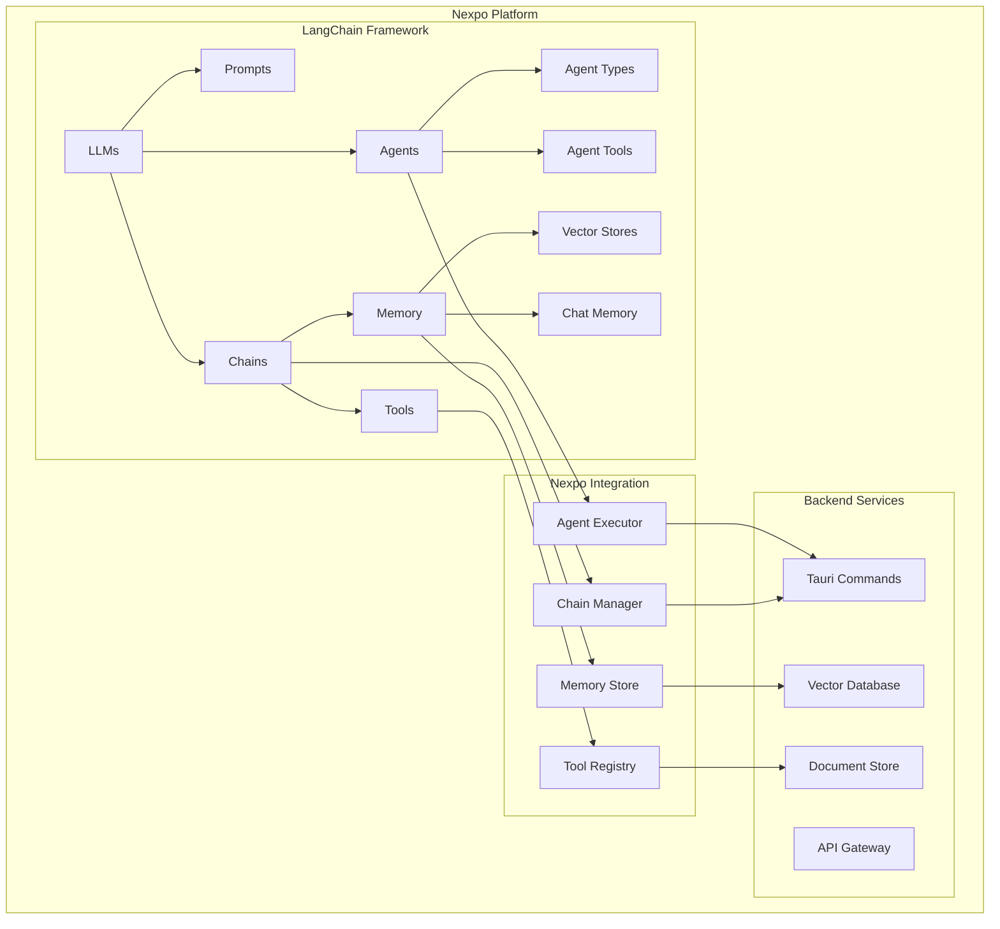

# LangChain

[LangChain](https://langchain.com/)
[Auth0](https://auth0.com/ai/docs/langchain-sdk)


## Overview

LangChain is a powerful framework for developing applications powered by language models. In the Nexpo ecosystem, LangChain provides advanced capabilities for building sophisticated AI applications including chatbots, document analysis, code generation, and complex reasoning systems. This integration leverages Tauri for native backend performance and Svelte for reactive frontend experiences.

## Architecture

### LangChain Core Components



## Installation and Setup

### Dependencies

```toml
# Cargo.toml
[dependencies]
langchain-rust = "0.1.0"
tokio = { version = "1.0", features = ["full"] }
serde = { version = "1.0", features = ["derive"] }
tauri = { version = "1.0", features = ["api-all"] }
reqwest = { version = "0.11", features = ["json"] }
uuid = { version = "1.0", features = ["v4"] }
```

```toml
# pyproject.toml
[tool.uv.dependencies]
langchain = "^0.1.0"
langchain-openai = "^0.0.8"
langchain-anthropic = "^0.1.0"
langchain-community = "^0.0.38"
chromadb = "^0.4.0"
faiss-cpu = "^1.7.4"
tiktoken = "^0.6.0"
pydantic = "^2.6.0"
```

## Core Components

### Rust Backend Integration

```rust
use serde::{Deserialize, Serialize};
use std::collections::HashMap;
use uuid::Uuid;

#[derive(Debug, Clone, Serialize, Deserialize)]
pub struct LangChainConfig {
    pub llm_provider: LLMProvider,
    pub model_name: String,
    pub temperature: f32,
    pub max_tokens: u32,
    pub api_key: String,
}

#[derive(Debug, Clone, Serialize, Deserialize)]
pub enum LLMProvider {
    OpenAI,
    Anthropic,
    Ollama,
    HuggingFace,
    Azure,
}

#[derive(Debug, Clone, Serialize, Deserialize)]
pub struct Chain {
    pub id: Uuid,
    pub name: String,
    pub chain_type: ChainType,
    pub config: LangChainConfig,
    pub prompt_template: String,
    pub memory_enabled: bool,
}

#[derive(Debug, Clone, Serialize, Deserialize)]
pub enum ChainType {
    LLM,
    ConversationChain,
    RetrievalQA,
    SQLDatabase,
    APIChain,
    MathChain,
}
```

### Tauri Commands

```rust
use tauri::{command, State};

#[command]
pub async fn create_chain(
    manager: State<'_, LangChainManager>,
    name: String,
    chain_type: ChainType,
    config: LangChainConfig,
    prompt_template: String,
    memory_enabled: bool,
) -> Result<Uuid, String> {
    let chain = Chain {
        id: Uuid::new_v4(),
        name,
        chain_type,
        config,
        prompt_template,
        memory_enabled,
    };
    
    let chain_id = chain.id;
    manager.chains.lock().unwrap().insert(chain_id, chain);
    
    Ok(chain_id)
}

#[command]
pub async fn execute_chain(
    manager: State<'_, LangChainManager>,
    chain_id: Uuid,
    input: String,
) -> Result<String, String> {
    let chain = manager.chains.lock().unwrap()
        .get(&chain_id)
        .ok_or("Chain not found")?
        .clone();
        
    execute_python_chain(chain, input).await
}
```

## Python Implementation

### Chain Creation and Execution

```python
from langchain.llms import OpenAI, Anthropic
from langchain.chat_models import ChatOpenAI, ChatAnthropic
from langchain.chains import LLMChain, ConversationChain, RetrievalQA
from langchain.agents import initialize_agent, AgentType, Tool
from langchain.memory import ConversationBufferMemory
from langchain.prompts import PromptTemplate
from langchain.tools import DuckDuckGoSearchRun, PythonREPLTool
import json
from typing import Dict, Any, Optional

class NexpoLangChain:
    def __init__(self):
        self.chains: Dict[str, Any] = {}
        self.agents: Dict[str, Any] = {}
        
    def create_llm(self, config: Dict[str, Any]):
        provider = config.get("llm_provider")
        model_name = config.get("model_name")
        temperature = config.get("temperature", 0.7)
        api_key = config.get("api_key")
        
        if provider == "OpenAI":
            if "gpt-" in model_name:
                return ChatOpenAI(
                    model_name=model_name,
                    temperature=temperature,
                    openai_api_key=api_key
                )
            else:
                return OpenAI(
                    model_name=model_name,
                    temperature=temperature,
                    openai_api_key=api_key
                )
        elif provider == "Anthropic":
            return ChatAnthropic(
                model=model_name,
                temperature=temperature,
                anthropic_api_key=api_key
            )
        else:
            raise ValueError(f"Unsupported provider: {provider}")
    
    def create_chain(self, chain_config: Dict[str, Any]) -> str:
        chain_id = chain_config.get("id")
        chain_type = chain_config.get("chain_type")
        config = chain_config.get("config")
        prompt_template = chain_config.get("prompt_template")
        memory_enabled = chain_config.get("memory_enabled", False)
        
        llm = self.create_llm(config)
        prompt = PromptTemplate.from_template(prompt_template)
        
        if chain_type == "LLM":
            chain = LLMChain(llm=llm, prompt=prompt)
        elif chain_type == "ConversationChain":
            memory = ConversationBufferMemory() if memory_enabled else None
            chain = ConversationChain(llm=llm, prompt=prompt, memory=memory)
        else:
            chain = LLMChain(llm=llm, prompt=prompt)
        
        self.chains[chain_id] = chain
        return chain_id
    
    def execute_chain(self, chain_id: str, input_text: str) -> str:
        if chain_id not in self.chains:
            raise ValueError(f"Chain {chain_id} not found")
        
        chain = self.chains[chain_id]
        
        try:
            result = chain.run(input=input_text)
            return str(result)
        except Exception as e:
            return f"Error: {str(e)}"

# Global instance
nexpo_langchain = NexpoLangChain()

def execute_chain(chain_config_json: str, input_text: str) -> str:
    try:
        chain_config = json.loads(chain_config_json)
        chain_id = nexpo_langchain.create_chain(chain_config)
        return nexpo_langchain.execute_chain(chain_id, input_text)
    except Exception as e:
        return f"Error: {str(e)}"
```

## Frontend Integration (Svelte)

### LangChain Store

```typescript
// stores/langchain.ts
import { writable, derived } from 'svelte/store';
import { invoke } from '@tauri-apps/api/tauri';

export interface Chain {
  id: string;
  name: string;
  chainType: string;
  config: any;
  promptTemplate: string;
  memoryEnabled: boolean;
}

export interface Message {
  id: string;
  role: 'Human' | 'AI';
  content: string;
  timestamp: string;
}

export const chains = writable<Chain[]>([]);
export const messages = writable<Message[]>([]);
export const isExecuting = writable<boolean>(false);

export const langchainActions = {
  async createChain(chainData: Omit<Chain, 'id'>) {
    const chainId = await invoke<string>('create_chain', chainData);
    const newChain: Chain = { ...chainData, id: chainId };
    chains.update(current => [...current, newChain]);
    return chainId;
  },
  
  async executeChain(chainId: string, input: string) {
    isExecuting.set(true);
    try {
      const result = await invoke<string>('execute_chain', { chainId, input });
      
      // Add messages
      const userMessage: Message = {
        id: crypto.randomUUID(),
        role: 'Human',
        content: input,
        timestamp: new Date().toISOString()
      };
      
      const aiMessage: Message = {
        id: crypto.randomUUID(),
        role: 'AI',
        content: result,
        timestamp: new Date().toISOString()
      };
      
      messages.update(current => [...current, userMessage, aiMessage]);
      
      return result;
    } finally {
      isExecuting.set(false);
    }
  }
};
```

### Chat Interface Component

```svelte
<!-- components/LangChainChat.svelte -->
<script lang="ts">
  import { chains, messages, isExecuting, langchainActions } from '../stores/langchain';
  
  let selectedChain: string = '';
  let inputText: string = '';
  
  async function sendMessage() {
    if (!inputText.trim() || !selectedChain || $isExecuting) return;
    
    try {
      await langchainActions.executeChain(selectedChain, inputText);
      inputText = '';
    } catch (error) {
      console.error('Failed to send message:', error);
    }
  }
  
  function handleKeyPress(event: KeyboardEvent) {
    if (event.key === 'Enter' && !event.shiftKey) {
      event.preventDefault();
      sendMessage();
    }
  }
</script>

<div class="langchain-chat">
  <header>
    <h1>🦜🔗 LangChain Chat</h1>
    <select bind:value={selectedChain} class="chain-selector">
      <option value="">Select a chain...</option>
      {#each $chains as chain}
        <option value={chain.id}>{chain.name}</option>
      {/each}
    </select>
  </header>
  
  <div class="messages-container">
    {#each $messages as message}
      <div class="message" class:user={message.role === 'Human'} class:ai={message.role === 'AI'}>
        <div class="message-header">
          <span class="role">{message.role === 'Human' ? '👤' : '🤖'} {message.role}</span>
          <span class="timestamp">{new Date(message.timestamp).toLocaleTimeString()}</span>
        </div>
        <div class="message-content">{message.content}</div>
      </div>
    {/each}
  </div>
  
  <div class="input-container">
    <textarea
      bind:value={inputText}
      on:keypress={handleKeyPress}
      placeholder="Type your message..."
      class="message-input"
      disabled={!selectedChain || $isExecuting}
    ></textarea>
    <button
      on:click={sendMessage}
      disabled={!inputText.trim() || !selectedChain || $isExecuting}
      class="send-button"
    >
      {$isExecuting ? '⏳' : '📤'}
    </button>
  </div>
</div>

<style>
  .langchain-chat {
    display: flex;
    flex-direction: column;
    height: 100vh;
    background: linear-gradient(135deg, #667eea 0%, #764ba2 100%);
    color: white;
  }
  
  header {
    padding: 1rem;
    border-bottom: 1px solid rgba(255, 255, 255, 0.2);
    display: flex;
    justify-content: space-between;
    align-items: center;
  }
  
  .chain-selector {
    background: rgba(255, 255, 255, 0.1);
    border: 1px solid rgba(255, 255, 255, 0.3);
    border-radius: 8px;
    padding: 0.5rem;
    color: white;
  }
  
  .messages-container {
    flex: 1;
    overflow-y: auto;
    padding: 1rem;
    display: flex;
    flex-direction: column;
    gap: 1rem;
  }
  
  .message {
    background: rgba(255, 255, 255, 0.1);
    backdrop-filter: blur(10px);
    border-radius: 12px;
    padding: 1rem;
    max-width: 80%;
  }
  
  .message.user {
    align-self: flex-end;
    background: rgba(59, 130, 246, 0.3);
  }
  
  .message.ai {
    align-self: flex-start;
    background: rgba(16, 185, 129, 0.3);
  }
  
  .message-header {
    display: flex;
    justify-content: space-between;
    margin-bottom: 0.5rem;
    font-size: 0.8rem;
    opacity: 0.8;
  }
  
  .input-container {
    padding: 1rem;
    border-top: 1px solid rgba(255, 255, 255, 0.2);
    display: flex;
    gap: 1rem;
  }
  
  .message-input {
    flex: 1;
    background: rgba(255, 255, 255, 0.1);
    border: 1px solid rgba(255, 255, 255, 0.3);
    border-radius: 8px;
    padding: 0.75rem;
    color: white;
    resize: none;
    height: 60px;
  }
  
  .send-button {
    background: #10b981;
    border: none;
    border-radius: 8px;
    padding: 0.75rem 1.5rem;
    color: white;
    cursor: pointer;
    font-size: 1.2rem;
  }
  
  .send-button:hover:not(:disabled) {
    background: #059669;
  }
  
  .send-button:disabled {
    opacity: 0.5;
    cursor: not-allowed;
  }
</style>
```

## Best Practices

### Chain Design
1. **Clear Prompts**: Write specific, well-structured prompt templates
2. **Memory Management**: Use appropriate memory types for conversation context
3. **Tool Selection**: Choose tools that match your use case requirements
4. **Error Handling**: Implement robust error recovery mechanisms

### Agent Configuration
1. **Agent Types**: Select the right agent type for your specific task
2. **Tool Integration**: Provide agents with necessary and sufficient tools
3. **LLM Optimization**: Configure temperature and token limits appropriately
4. **Verbose Logging**: Enable detailed logging for debugging and monitoring

### Performance Optimization
1. **Caching**: Cache frequently used chains and agent configurations
2. **Streaming**: Implement streaming for real-time responses
3. **Batch Processing**: Group similar requests for efficiency
4. **Resource Management**: Monitor API usage and costs

## Common Use Cases

### Conversational AI
- Customer support chatbots
- Personal assistants
- Educational tutors
- Creative writing assistants

### Document Processing
- Question answering over documents
- Document summarization
- Information extraction
- Content analysis

### Code Generation
- Code completion and suggestions
- Bug fixing and optimization
- Documentation generation
- Test case creation

### Data Analysis
- Natural language to SQL queries
- Report generation
- Data visualization recommendations
- Statistical analysis explanations

## External Links
- [LangChain Official Documentation](https://python.langchain.com/docs/get_started/introduction)
- [LangChain Python Package](https://pypi.org/project/langchain/)
- [LangChain Community](https://github.com/langchain-ai/langchain)
