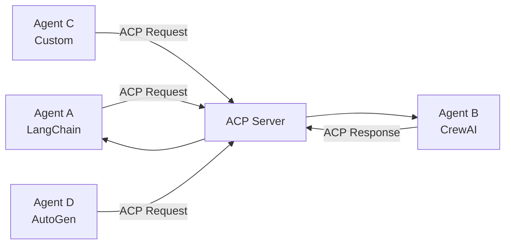

# IBM Agent Communication Protocol (ACP)

## Table of Contents

- [Overview](#overview)
- [Key Features](#key-features)
- [Architecture](#architecture)
- [Protocol Comparison](#protocol-comparison)
- [Use Cases](#use-cases)
- [BeeAI Integration](#beeai-integration)
- [Nexpo Integration Guide](#nexpo-integration-guide)
- [Getting Started](#getting-started)
- [API Reference](#api-reference)
- [Best Practices](#best-practices)
- [Current Status](#current-status)
- [Resources](#resources)

## Overview

The **Agent Communication Protocol (ACP)** from IBM is an open standard designed to enable seamless communication between AI agents, regardless of their underlying frameworks, programming languages, or runtime environments. Developed by IBM Research and contributed to the Linux Foundation as part of the BeeAI project, ACP aims to address the fragmentation in the AI agent ecosystem by providing a standardized, RESTful interface for agent-to-agent communication.

> 🎯 **Goal**: Enable agents built on different platforms (e.g., LangChain, CrewAI, or custom stacks) to discover, interact, and collaborate efficiently without requiring custom integrations.

### Why ACP Matters

ACP addresses the challenges of fragmented agent ecosystems, where custom integrations are costly and non-scalable. By standardizing communication, it enables developers to build modular, interoperable, and scalable multi-agent systems, fostering innovation and collaboration across industries. IBM positions ACP as the **"HTTP of agent communication,"** aiming to create an interconnected network of agents that can work together seamlessly.

## Key Features

### 🌐 REST-Based Communication
- Uses standard HTTP patterns for easy integration
- Compatible with existing web infrastructure
- Works with tools like `curl` or Postman
- Python and TypeScript SDKs available (but not required)

### 🔄 Framework Agnosticism
- Supports agents built with any framework
- Enables interoperability across diverse systems, teams, and organizations
- No vendor lock-in or framework dependencies

### ⚡ Asynchronous and Synchronous Support
- **Asynchronous by default** - ideal for long-running tasks
- **Synchronous support** - available for low-latency use cases
- Flexible communication patterns based on requirements

### 📊 Multimodal Message Support
- Exchange structured data, text, images, or embeddings
- Suitable for complex workflows involving:
  - Large Language Models (LLMs)
  - Vision models
  - Hybrid AI systems

### 🔍 Offline Agent Discovery
- Agents advertise capabilities through metadata in packages
- Discovery works in secure or disconnected environments
- No central registry required

### 🔒 Security and Observability
- **Capability tokens** for secure interactions
- **OpenTelemetry (OTLP)** instrumentation for monitoring
- Auditable agent activities and communications

### 🏛️ Open Governance
- Managed under the Linux Foundation
- Community-driven development
- Avoiding vendor lock-in
- Open to contributions from the broader AI ecosystem

## Architecture

### How ACP Works

ACP enables agents to communicate through a standardized RESTful API, acting as a "universal connector" for AI agents. Agents hosted on ACP servers receive requests from ACP clients (which can also be agents) and execute tasks accordingly.



### Core Components

#### 🔍 Dynamic Discovery
- Agents advertise capabilities via manifests
- Automatic discovery of functions and schemas
- Peer-to-peer capability negotiation

#### 📋 Task Delegation and Routing
- Structured message envelopes
- Task IDs and metadata management
- Optional streaming channels for workflows

#### 💾 Stateful Sessions
- Persistent contexts for long-running agents
- Continuity across multiple interactions
- Session state management

### Enterprise Example

In an enterprise setting, a workflow orchestration bot could use ACP to:
1. Pass a purchase order to a **policy-checking agent**
2. Forward to a **reporting agent** for documentation
3. All agents built on different frameworks communicate seamlessly via ACP

## Protocol Comparison

| Protocol | Focus | Scope | Integration |
|----------|--------|-------|-------------|
| **ACP (IBM)** | Agent-to-agent communication | Enterprise/Local | BeeAI platform |
| **MCP (Anthropic)** | LLM-to-tools connection | Context management | Claude, tools |
| **A2A (Google)** | Cross-vendor interoperability | Public internet | Agent Cards |
| **ANP** | Decentralized collaboration | Distributed systems | DIDs |

### Model Context Protocol (MCP)
- **Focus**: Connecting LLMs to tools and data sources (APIs, databases)
- **Analogy**: "USB-C port" for AI context
- **Relationship**: ACP builds on MCP's foundation but extends to agent-to-agent communication

### Agent-to-Agent (A2A) by Google
- **Focus**: Cross-vendor interoperability over the public internet
- **Discovery**: Uses Agent Cards for capability discovery
- **Difference**: ACP is optimized for local-first, low-latency communication

### Agent Network Protocol (ANP)
- **Focus**: Decentralized discovery and collaboration
- **Method**: Uses decentralized identifiers (DIDs)
- **Difference**: ACP prioritizes simpler, REST-based interactions for enterprise environments

## Use Cases

### 🏢 Enterprise Workflows
**Customer Support Automation**
- Customer support agent ↔ Inventory agent
- Resolve complaints about delayed shipments
- Cross-system collaboration and data sharing

### 🤝 Inter-Organizational Collaboration
- Secure collaboration between different companies
- Agents from partner organizations working together
- New models for business partnership automation

### 🔬 Automated Data Science
1. **Crawler agent** gathers data
2. **Vector-index builder** organizes the data
3. **Authoring agent** generates insights
4. All coordinated seamlessly via ACP

### 🛡️ Security Operations
- Stream security logs between agents
- Enrich threat intelligence automatically
- Trigger mitigation actions
- Auditable security interactions

## BeeAI Integration

ACP serves as the communication backbone of **BeeAI**, an open-source platform for discovering, running, and composing AI agents.

### What BeeAI Provides
- Simplified deployment of ACP-compliant agents
- Management interface for agent workflows
- Integration of agents from various frameworks
- Cohesive multi-agent system orchestration

### Benefits
- **Unified Platform**: Single interface for multiple agent types
- **Framework Flexibility**: Use any AI framework underneath
- **Easy Deployment**: Streamlined agent deployment process
- **Workflow Management**: Visual and programmatic workflow design

## Nexpo Integration Guide

### Prerequisites

```bash
# Install ACP SDK
pnpm add @ibm-research/acp-sdk

# Or using Python
pip install acp-sdk
```

### Environment Configuration

Add to your `.env` file:

```env
# IBM ACP Configuration
IBM_ACP_ENABLED=true
IBM_ACP_SERVER_URL=http://localhost:8080
IBM_ACP_API_KEY=your-acp-api-key
IBM_ACP_AGENT_ID=nexpo-agent

# BeeAI Integration
BEEAI_WORKSPACE_URL=https://your-beeai-workspace.com
BEEAI_API_TOKEN=your-beeai-token
```

### Basic Agent Implementation

#### TypeScript Example

```typescript
import { ACPClient, ACPServer, Agent } from '@ibm-research/acp-sdk';

// Create an ACP-compliant agent
class NexpoAgent extends Agent {
  constructor() {
    super({
      id: 'nexpo-agent',
      name: 'Nexpo AI Assistant',
      description: 'AI agent for Nexpo platform',
      capabilities: [
        'user-management',
        'data-analysis',
        'report-generation'
      ]
    });
  }

  async processRequest(request: ACPRequest): Promise<ACPResponse> {
    const { task, data } = request;
    
    switch (task) {
      case 'analyze-user-data':
        return await this.analyzeUserData(data);
      case 'generate-report':
        return await this.generateReport(data);
      default:
        throw new Error(`Unknown task: ${task}`);
    }
  }

  private async analyzeUserData(data: any): Promise<ACPResponse> {
    // Implement user data analysis
    return {
      success: true,
      result: {
        analysis: 'User engagement is trending upward',
        metrics: { engagement: 0.85, retention: 0.72 }
      }
    };
  }
}

// Start the agent server
const agent = new NexpoAgent();
const server = new ACPServer(agent, {
  port: 8080,
  host: '0.0.0.0'
});

server.start();
```

#### Client Usage

```typescript
import { ACPClient } from '@ibm-research/acp-sdk';

// Connect to an ACP agent
const client = new ACPClient({
  serverUrl: process.env.IBM_ACP_SERVER_URL,
  apiKey: process.env.IBM_ACP_API_KEY
});

// Discover available agents
const agents = await client.discoverAgents();
console.log('Available agents:', agents);

// Send a task to an agent
const response = await client.sendTask({
  agentId: 'nexpo-agent',
  task: 'analyze-user-data',
  data: {
    userId: '12345',
    timeframe: '30days'
  }
});

console.log('Analysis result:', response.result);
```

### Integration with Nexpo Microservices

#### API Gateway Integration

```typescript
// Kong Gateway plugin for ACP routing
app.post('/api/v1/agents/:agentId/tasks', async (req, res) => {
  const { agentId } = req.params;
  const { task, data } = req.body;
  
  try {
    const client = new ACPClient({
      serverUrl: process.env.IBM_ACP_SERVER_URL,
      apiKey: process.env.IBM_ACP_API_KEY
    });
    
    const result = await client.sendTask({
      agentId,
      task,
      data,
      metadata: {
        userId: req.user?.id,
        requestId: req.id
      }
    });
    
    res.json(result);
  } catch (error) {
    res.status(500).json({ error: error.message });
  }
});
```

### Multi-Agent Workflow Example

```typescript
// Nexpo multi-agent workflow
class NexpoWorkflow {
  private acpClient: ACPClient;
  
  constructor() {
    this.acpClient = new ACPClient({
      serverUrl: process.env.IBM_ACP_SERVER_URL,
      apiKey: process.env.IBM_ACP_API_KEY
    });
  }
  
  async processUserOnboarding(userData: any) {
    // Step 1: Validate user data
    const validation = await this.acpClient.sendTask({
      agentId: 'validation-agent',
      task: 'validate-user-data',
      data: userData
    });
    
    if (!validation.success) {
      throw new Error('User data validation failed');
    }
    
    // Step 2: Create user profile
    const profile = await this.acpClient.sendTask({
      agentId: 'profile-agent',
      task: 'create-profile',
      data: validation.result
    });
    
    // Step 3: Send welcome email
    await this.acpClient.sendTask({
      agentId: 'notification-agent',
      task: 'send-welcome-email',
      data: {
        userId: profile.result.id,
        email: userData.email
      }
    });
    
    return profile.result;
  }
}
```

## Getting Started

### 1. Installation

```bash
# TypeScript/Node.js
pnpm add @ibm-research/acp-sdk

# Python
pip install acp-sdk

# Go
go get github.com/IBM-Research/acp-go-sdk
```

### 2. Basic Setup

```typescript
// Create your first ACP agent
import { Agent, ACPServer } from '@ibm-research/acp-sdk';

class HelloWorldAgent extends Agent {
  constructor() {
    super({
      id: 'hello-world',
      name: 'Hello World Agent',
      description: 'A simple greeting agent',
      capabilities: ['greeting']
    });
  }

  async processRequest(request) {
    return {
      success: true,
      message: `Hello, ${request.data.name || 'World'}!`
    };
  }
}

const agent = new HelloWorldAgent();
const server = new ACPServer(agent, { port: 3001 });
server.start();
```

### 3. Testing Your Agent

```bash
# Test with curl
curl -X POST http://localhost:3001/acp/v1/tasks \
  -H "Content-Type: application/json" \
  -d '{
    "task": "greeting",
    "data": {"name": "Developer"}
  }'
```

## API Reference

### Core Endpoints

#### Agent Discovery
```http
GET /acp/v1/agents
```

Response:
```json
{
  "agents": [
    {
      "id": "nexpo-agent",
      "name": "Nexpo AI Assistant",
      "description": "AI agent for Nexpo platform",
      "capabilities": ["user-management", "data-analysis"],
      "version": "1.0.0",
      "status": "active"
    }
  ]
}
```

#### Task Execution
```http
POST /acp/v1/tasks
Content-Type: application/json

{
  "agentId": "nexpo-agent",
  "task": "analyze-user-data",
  "data": {
    "userId": "12345",
    "metrics": ["engagement", "retention"]
  },
  "metadata": {
    "requestId": "req-123",
    "priority": "high"
  }
}
```

#### Health Check
```http
GET /acp/v1/health
```

### Message Formats

#### Request Format
```typescript
interface ACPRequest {
  agentId: string;
  task: string;
  data: any;
  metadata?: {
    requestId?: string;
    priority?: 'low' | 'normal' | 'high';
    timeout?: number;
    streaming?: boolean;
  };
}
```

#### Response Format
```typescript
interface ACPResponse {
  success: boolean;
  result?: any;
  error?: {
    code: string;
    message: string;
    details?: any;
  };
  metadata?: {
    executionTime?: number;
    agentVersion?: string;
    requestId?: string;
  };
}
```

## Best Practices

### 🏗️ Agent Design

1. **Single Responsibility**: Each agent should have a clear, focused purpose
2. **Stateless Design**: Avoid storing state between requests when possible
3. **Clear Capabilities**: Advertise exactly what your agent can do
4. **Error Handling**: Provide meaningful error messages and codes

### 🔒 Security

1. **Authentication**: Always use capability tokens for production
2. **Input Validation**: Validate all incoming request data
3. **Rate Limiting**: Implement rate limiting for your agents
4. **Audit Logging**: Log all agent interactions for security monitoring

### ⚡ Performance

1. **Async Operations**: Use asynchronous processing for long-running tasks
2. **Caching**: Cache frequently requested data
3. **Connection Pooling**: Reuse connections when possible
4. **Monitoring**: Implement health checks and metrics collection

### 📊 Observability

```typescript
import { trace, SpanStatusCode } from '@opentelemetry/api';

class ObservableAgent extends Agent {
  async processRequest(request: ACPRequest): Promise<ACPResponse> {
    const span = trace.getActiveSpan();
    span?.setAttributes({
      'acp.agent.id': this.id,
      'acp.task': request.task,
      'acp.request.id': request.metadata?.requestId
    });
    
    try {
      const result = await this.executeTask(request);
      span?.setStatus({ code: SpanStatusCode.OK });
      return result;
    } catch (error) {
      span?.setStatus({ 
        code: SpanStatusCode.ERROR, 
        message: error.message 
      });
      throw error;
    }
  }
}
```

## Current Status

### Development Stage
- **Current**: Alpha/pre-alpha stage
- **Stability**: Active development with breaking changes possible
- **Community**: Open community discussions on GitHub
- **Governance**: Linux Foundation management ensures open development

### Learning Resources
- **DeepLearning.AI Course**: Short course on ACP development (IBM partnership)
- **GitHub Repository**: Active development and community contributions
- **Documentation**: Comprehensive guides at [agentcommunicationprotocol.dev](https://agentcommunicationprotocol.dev)
- **BeeAI Platform**: Integration examples and deployment guides

### Contributing

IBM encourages developers to contribute to ACP's evolution:
- **GitHub**: Submit issues, feature requests, and pull requests
- **Community**: Join discussions and working groups
- **Standards**: Help shape the protocol specification
- **Implementation**: Contribute SDK improvements and examples

## Resources

### Official Documentation
- **ACP Protocol**: [agentcommunicationprotocol.dev](https://agentcommunicationprotocol.dev)
- **BeeAI Platform**: [GitHub - BeeAI Project](https://github.com/beehive-ai/beeai)
- **IBM Research**: [research.ibm.com](https://research.ibm.com)

### Development Tools
- **TypeScript SDK**: `@ibm-research/acp-sdk`
- **Python SDK**: `acp-sdk`
- **Go SDK**: `github.com/IBM-Research/acp-go-sdk`
- **REST Client**: Standard HTTP tools (curl, Postman, etc.)

### Community
- **GitHub Discussions**: Protocol development and community support
- **Linux Foundation**: Open governance and collaboration
- **DeepLearning.AI**: Educational content and courses
- **IBM Developer**: Technical resources and guides

### Related Protocols
- **Model Context Protocol (MCP)**: [Anthropic MCP](https://modelcontextprotocol.io)
- **Google A2A**: [Agent-to-Agent Protocol](https://developers.google.com/agent-platform)
- **OpenTelemetry**: [Observability Framework](https://opentelemetry.io)

---

> **Next Steps**: Ready to integrate ACP into your Nexpo application? Start with the [Getting Started](#getting-started) section and explore the [Nexpo Integration Guide](#nexpo-integration-guide) for specific implementation details.