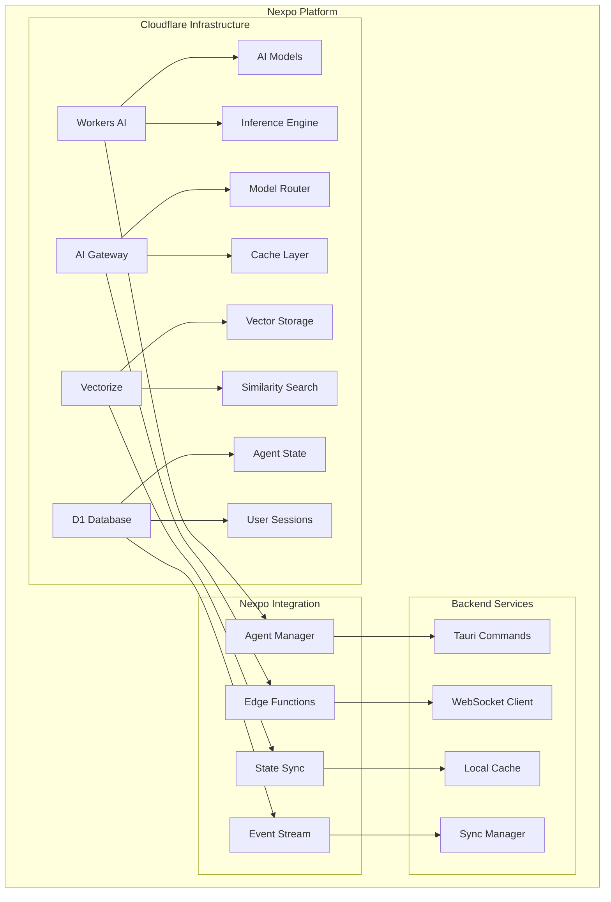

# Cloudflare Agents Integration with Nexpo

## Overview

Cloudflare Agents represents a cutting-edge approach to deploying AI agents at the edge using Cloudflare's global infrastructure. In the Nexpo ecosystem, Cloudflare Agents provide ultra-low latency AI capabilities, serverless scalability, and distributed deployment options. This integration leverages Cloudflare Workers AI, AI Gateway, and Vectorize for comprehensive edge-based AI solutions.

## Architecture

### Cloudflare AI Stack



## Installation and Setup

### Dependencies

```toml
# Cargo.toml
[dependencies]
cloudflare = "0.10.0"
reqwest = { version = "0.11", features = ["json"] }
serde = { version = "1.0", features = ["derive"] }
tauri = { version = "1.0", features = ["api-all"] }
tokio = { version = "1.0", features = ["full"] }
uuid = { version = "1.0", features = ["v4"] }
```

```json
// wrangler.toml
name = "nexpo-ai-agents"
main = "src/index.ts"
compatibility_date = "2024-01-15"

[ai]
binding = "AI"

[vectorize]
binding = "VECTORIZE"
index_name = "nexpo-embeddings"

[[d1_databases]]
binding = "DB"
database_name = "nexpo-agents"
database_id = "your-database-id"
```

## Core Components

### Rust Backend Integration

```rust
use serde::{Deserialize, Serialize};
use std::collections::HashMap;
use uuid::Uuid;

#[derive(Debug, Clone, Serialize, Deserialize)]
pub struct CloudflareAgent {
    pub id: Uuid,
    pub name: String,
    pub model: CloudflareModel,
    pub prompt_template: String,
    pub system_prompt: Option<String>,
    pub temperature: f32,
    pub max_tokens: u32,
    pub edge_locations: Vec<String>,
}

#[derive(Debug, Clone, Serialize, Deserialize)]
pub enum CloudflareModel {
    Llama2_7b,
    Llama2_13b,
    CodeLlama_7b,
    Mistral_7b,
    SqlCoder_7b,
    TextEmbedding,
}

#[derive(Debug, Clone, Serialize, Deserialize)]
pub struct AgentExecution {
    pub id: Uuid,
    pub agent_id: Uuid,
    pub input: String,
    pub output: Option<String>,
    pub status: ExecutionStatus,
    pub edge_location: String,
    pub latency_ms: Option<u64>,
    pub created_at: chrono::DateTime<chrono::Utc>,
}

#[derive(Debug, Clone, Serialize, Deserialize)]
pub enum ExecutionStatus {
    Pending,
    Running,
    Completed,
    Failed,
}
```

### Tauri Commands

```rust
use tauri::{command, State};

#[command]
pub async fn create_cloudflare_agent(
    manager: State<'_, CloudflareAgentManager>,
    name: String,
    model: CloudflareModel,
    prompt_template: String,
    system_prompt: Option<String>,
    temperature: f32,
    max_tokens: u32,
) -> Result<Uuid, String> {
    let agent = CloudflareAgent {
        id: Uuid::new_v4(),
        name,
        model,
        prompt_template,
        system_prompt,
        temperature,
        max_tokens,
        edge_locations: vec!["auto".to_string()],
    };
    
    let agent_id = agent.id;
    manager.agents.lock().unwrap().insert(agent_id, agent);
    
    Ok(agent_id)
}

#[command]
pub async fn execute_cloudflare_agent(
    manager: State<'_, CloudflareAgentManager>,
    agent_id: Uuid,
    input: String,
) -> Result<AgentExecution, String> {
    // Execute via Cloudflare Workers AI
    manager.execute_agent(agent_id, input).await
}
```

## Cloudflare Workers Implementation

### Edge Function Template

```typescript
// worker.ts
export default {
  async fetch(request: Request, env: Env, ctx: ExecutionContext): Promise<Response> {
    const { AI, VECTORIZE, DB } = env;
    
    if (request.method !== 'POST') {
      return new Response('Method not allowed', { status: 405 });
    }
    
    const body = await request.json();
    const { input, agent_config, session_id } = body;
    
    try {
      // Execute AI model
      const response = await AI.run(agent_config.model, {
        messages: [
          {
            role: 'system',
            content: agent_config.system_prompt || ''
          },
          {
            role: 'user',
            content: input
          }
        ],
        temperature: agent_config.temperature,
        max_tokens: agent_config.max_tokens
      });
      
      // Store execution in D1
      if (session_id) {
        await DB.prepare(
          'INSERT INTO executions (id, agent_id, input, output, edge_location, created_at) VALUES (?, ?, ?, ?, ?, ?)'
        ).bind(
          crypto.randomUUID(),
          agent_config.id,
          input,
          response.response,
          request.cf?.colo || 'unknown',
          new Date().toISOString()
        ).run();
      }
      
      return Response.json({
        success: true,
        result: response.response,
        edge_location: request.cf?.colo || 'unknown',
        model: agent_config.model
      });
    } catch (error) {
      return Response.json({
        success: false,
        error: error.message
      }, { status: 500 });
    }
  }
};

interface Env {
  AI: any;
  VECTORIZE: any;
  DB: any;
}
```

## Frontend Integration (Svelte)

### Cloudflare Store

```typescript
// stores/cloudflare.ts
import { writable, derived } from 'svelte/store';
import { invoke } from '@tauri-apps/api/tauri';

export interface CloudflareAgent {
  id: string;
  name: string;
  model: string;
  promptTemplate: string;
  systemPrompt?: string;
  temperature: number;
  maxTokens: number;
  edgeLocations: string[];
}

export interface AgentExecution {
  id: string;
  agentId: string;
  input: string;
  output?: string;
  status: string;
  edgeLocation: string;
  latencyMs?: number;
  createdAt: string;
}

export const cloudflareAgents = writable<CloudflareAgent[]>([]);
export const executions = writable<AgentExecution[]>([]);
export const isExecuting = writable<boolean>(false);

export const cloudflareActions = {
  async createAgent(agentData: Omit<CloudflareAgent, 'id'>) {
    const agentId = await invoke<string>('create_cloudflare_agent', agentData);
    const newAgent: CloudflareAgent = { ...agentData, id: agentId };
    cloudflareAgents.update(current => [...current, newAgent]);
    return agentId;
  },
  
  async executeAgent(agentId: string, input: string) {
    isExecuting.set(true);
    try {
      const execution = await invoke<AgentExecution>('execute_cloudflare_agent', {
        agentId,
        input
      });
      executions.update(current => [...current, execution]);
      return execution;
    } finally {
      isExecuting.set(false);
    }
  }
};
```

### Edge Dashboard Component

```svelte
<!-- components/CloudflareDashboard.svelte -->
<script lang="ts">
  import { cloudflareAgents, executions, isExecuting, cloudflareActions } from '../stores/cloudflare';
  
  let selectedAgent: string = '';
  let inputText: string = '';
  
  async function executeAgent() {
    if (!selectedAgent || !inputText.trim()) return;
    
    try {
      await cloudflareActions.executeAgent(selectedAgent, inputText);
      inputText = '';
    } catch (error) {
      console.error('Execution failed:', error);
    }
  }
</script>

<div class="cloudflare-dashboard">
  <header>
    <h1> Cloudflare Agents</h1>
    <p>Edge-deployed AI with global distribution</p>
  </header>
  
  <div class="dashboard-content">
    <div class="agents-panel">
      <h2> Deployed Agents</h2>
      <div class="agents-grid">
        {#each $cloudflareAgents as agent}
          <button
            class="agent-card"
            class:selected={selectedAgent === agent.id}
            on:click={() => selectedAgent = agent.id}
          >
            <h3>{agent.name}</h3>
            <p class="model">{agent.model}</p>
            <div class="agent-stats">
              <span> {agent.edgeLocations.length} locations</span>
              <span> {agent.temperature} temp</span>
            </div>
          </button>
        {/each}
      </div>
    </div>
    
    <div class="execution-panel">
      <h2> Execute at Edge</h2>
      {#if selectedAgent}
        <div class="execution-form">
          <textarea
            bind:value={inputText}
            placeholder="Enter your prompt..."
            disabled={$isExecuting}
          ></textarea>
          <button
            on:click={executeAgent}
            disabled={!inputText.trim() || $isExecuting}
            class="execute-button"
          >
            {$isExecuting ? ' Executing...' : ' Execute'}
          </button>
        </div>
        
        <div class="executions-list">
          <h3>Recent Executions</h3>
          {#each $executions.filter(e => e.agentId === selectedAgent).slice(-3) as execution}
            <div class="execution-item">
              <div class="execution-header">
                <span class="status">{execution.status}</span>
                <span class="location"> {execution.edgeLocation}</span>
                {#if execution.latencyMs}
                  <span class="latency"> {execution.latencyMs}ms</span>
                {/if}
              </div>
              <p class="input"> {execution.input}</p>
              {#if execution.output}
                <p class="output"> {execution.output}</p>
              {/if}
            </div>
          {/each}
        </div>
      {:else}
        <p>Select an agent to execute</p>
      {/if}
    </div>
  </div>
</div>

<style>
  .cloudflare-dashboard {
    padding: 2rem;
    background: linear-gradient(135deg, #f97316 0%, #ea580c 100%);
    color: white;
    min-height: 100vh;
  }
  
  .dashboard-content {
    display: grid;
    grid-template-columns: 1fr 1fr;
    gap: 2rem;
    margin-top: 2rem;
  }
  
  .agents-grid {
    display: grid;
    grid-template-columns: repeat(auto-fill, minmax(200px, 1fr));
    gap: 1rem;
    margin-top: 1rem;
  }
  
  .agent-card {
    background: rgba(255, 255, 255, 0.1);
    border: 1px solid rgba(255, 255, 255, 0.2);
    border-radius: 12px;
    padding: 1rem;
    cursor: pointer;
    transition: all 0.2s;
  }
  
  .agent-card:hover {
    background: rgba(255, 255, 255, 0.2);
    transform: translateY(-2px);
  }
  
  .agent-card.selected {
    background: rgba(59, 130, 246, 0.3);
    border-color: #3b82f6;
  }
  
  .execution-form {
    display: flex;
    flex-direction: column;
    gap: 1rem;
    margin-top: 1rem;
  }
  
  .execution-form textarea {
    background: rgba(255, 255, 255, 0.1);
    border: 1px solid rgba(255, 255, 255, 0.3);
    border-radius: 8px;
    padding: 1rem;
    color: white;
    min-height: 100px;
    resize: vertical;
  }
  
  .execute-button {
    background: #10b981;
    border: none;
    border-radius: 8px;
    padding: 1rem;
    color: white;
    cursor: pointer;
    font-weight: 600;
    transition: background 0.2s;
  }
  
  .execute-button:hover:not(:disabled) {
    background: #059669;
  }
  
  .execute-button:disabled {
    opacity: 0.6;
    cursor: not-allowed;
  }
  
  .execution-item {
    background: rgba(255, 255, 255, 0.05);
    border-radius: 8px;
    padding: 1rem;
    margin-bottom: 1rem;
  }
  
  .execution-header {
    display: flex;
    gap: 1rem;
    margin-bottom: 0.5rem;
    font-size: 0.8rem;
    opacity: 0.8;
  }
</style>
```

## Best Practices

### Edge Deployment
1. **Geographic Distribution**: Deploy agents to multiple edge locations
2. **Latency Optimization**: Choose edge locations closest to users
3. **Model Selection**: Use appropriate models for edge constraints
4. **Caching Strategy**: Implement effective caching for repeated requests

### Performance Optimization
1. **Resource Limits**: Respect Cloudflare Workers CPU and memory limits
2. **Request Batching**: Batch similar requests for efficiency
3. **Connection Pooling**: Reuse connections where possible
4. **Error Handling**: Implement robust error recovery

### Security
1. **API Key Management**: Secure API keys using Cloudflare secrets
2. **Rate Limiting**: Implement appropriate rate limits
3. **Input Validation**: Validate all inputs at the edge
4. **Output Filtering**: Filter sensitive information from responses

## Common Use Cases

### Real-time Chat
- Ultra-low latency conversational AI
- Global user support
- Edge-cached responses
- Distributed load handling

### Content Generation
- Dynamic content creation
- Personalized recommendations
- Code assistance
- Creative writing support

### Data Processing
- Edge analytics
- Real-time insights
- Document analysis
- Image classification

## External Links
- [Cloudflare Workers AI](https://developers.cloudflare.com/workers-ai/)
- [Cloudflare AI Gateway](https://developers.cloudflare.com/ai-gateway/)
