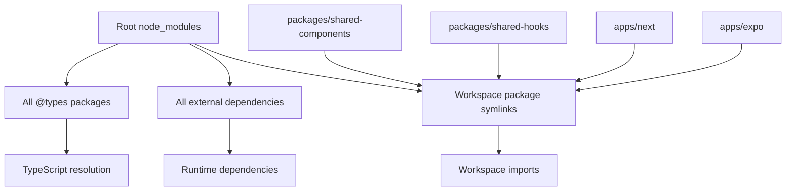

# Packaging Strategy: pnpm over npm in Nexpo

## Why pnpm is Critical for Nexpo

### 🎯 **Core Benefits**
1. **Disk Space Efficiency**: ~70% reduction through hard linking and deduplication
2. **Install Speed**: 2-3x faster than npm with parallel dependency resolution  
3. **Workspace Management**: Superior monorepo support with proper hoisting
4. **Security**: Stricter dependency resolution prevents phantom dependencies
5. **React Native Compatibility**: Flat node_modules structure via `shamefully-hoist=true`

### 🏗️ **Monorepo Architecture Problem**

**Current Issue**: Multiple `node_modules` folders across workspace packages
```
❌ INCORRECT (Multiple node_modules)
├── node_modules/ (root)
├── packages/shared-ui/node_modules/ ← SHOULD NOT EXIST
├── packages/shared-components/node_modules/ ← SHOULD NOT EXIST
├── apps/expo/node_modules/ ← SHOULD NOT EXIST
```

**Target Solution**: Single root `node_modules` with proper hoisting
```
✅ CORRECT (Single hoisted node_modules)
├── node_modules/ (root only - all dependencies hoisted here)
├── packages/shared-ui/ (symlinks to root node_modules)
├── packages/shared-components/ (symlinks to root node_modules)
├── apps/expo/ (symlinks to root node_modules)
```

---

## 📦 Package.json Analysis

### Root Package (`/package.json`)
**Purpose**: Workspace configuration and shared dependencies
- Defines workspace packages
- Contains shared devDependencies (@types/react, typescript, etc.)
- Manages build tools (turbo, etc.)

### Workspace Packages Analysis

| Package | Location | Dependencies Analysis |
|---------|----------|----------------------|
| `@shared/components` | `packages/shared-components/` | React, React Native, UI primitives |
| `@shared/hooks` | `packages/shared-hooks/` | React hooks, workspace deps |
| `@shared/pages` | `packages/shared-pages/` | Navigation, screen components |
| `@shared/provider` | `packages/shared-provider/` | Context providers, state management |
| `@shared/ui` | `packages/shared-ui/` | Base UI components |
| `@shared/utils` | `packages/shared-utils/` | Utility functions |
| `@shared/db` | `packages/shared-db/` | Database models, Prisma |
| `next-app` | `apps/next/` | Next.js app with Expo adapter |
| `expo-app` | `apps/expo/` | Native Expo application |
| `server` | `server/` | Backend API server |

---

## 🔧 Current Configuration Issues

### 1. **TypeScript Path Resolution**
```json
// tsconfig.json - FIXED
"paths": {
  "@shared/components": ["./packages/shared-components/src/index.ts"],
  "@shared/hooks": ["./packages/shared-hooks/src/index.ts"],
  // ... all @shared/* paths mapped correctly
}
```

### 2. **Workspace Dependencies**
```json
// package.json - FIXED  
"dependencies": {
  "@shared/hooks": "workspace:*",  // ✅ Correct workspace protocol
  "@shared/ui": "workspace:*"      // ✅ Correct workspace protocol
}
```

### 3. **pnpm Configuration (.pnpmrc)**
```ini
# CRITICAL for React Native/Expo compatibility
shamefully-hoist=true
auto-install-peers=true  
strict-peer-dependencies=false
link-workspace-packages=true
prefer-workspace-packages=true
shared-workspace-lockfile=true
save-workspace-protocol=rolling
```

---

## 🎯 Implementation Strategy

### Phase 1: Clean Up Multiple node_modules
```bash
# Remove all workspace-level node_modules
rm -rf packages/*/node_modules apps/*/node_modules server/node_modules

# Force clean pnpm install with proper hoisting
pnpm install --force
```

### Phase 2: Verify Hoisting
```bash
# Should only exist at root
ls node_modules/@types/react  ✅

# Should NOT exist in workspaces  
ls packages/shared-ui/node_modules  ❌
```

### Phase 3: TypeScript Resolution
- Root node_modules contains all @types packages
- Workspace packages use symlinks to root
- TypeScript paths resolve correctly via root tsconfig.json

---

## 🔍 Dependency Flow Analysis



---

## 🎉 Expected Outcomes

1. **Single Source of Truth**: One `node_modules` at root with pnpm hoisting
2. **Workspace Symlinks**: Individual workspace `node_modules` with symlinks (CORRECT with shamefully-hoist)
3. **Proper TypeScript**: @types/react resolved from root hoisted packages
4. **Workspace Imports**: `@shared/*` packages work correctly
5. **Metro Compatibility**: Flat structure for React Native bundler
6. **Disk Efficiency**: ~70% space savings vs individual node_modules
7. **Build Performance**: Faster installs and builds

---

## ✅ SOLUTION IMPLEMENTED - pnpm + Expo Integration Working

### **Key Discovery**: Workspace node_modules folders are CORRECT
With `shamefully-hoist=true`, pnpm **intentionally creates** workspace `node_modules` folders containing **symlinks** to root hoisted packages. This is the expected behavior for React Native/Expo compatibility, not a problem to fix.

### **Module Resolution Fix Applied**
**Problem**: `@expo/next-adapter` couldn't be resolved in `apps/next/next.config.js` due to pnpm's hoisted structure.

**Solution**: Updated `next.config.js` with fallback require logic:
```javascript
let withExpo;
try {
  withExpo = require('@expo/next-adapter').withExpo;
} catch (e) {
  // Fallback for pnpm hoisted structure
  try {
    withExpo = require(require.resolve('@expo/next-adapter', { 
      paths: [path.join(__dirname, '../../node_modules')] 
    })).withExpo;
  } catch (e2) {
    console.warn('Could not load @expo/next-adapter, using plain Next.js config');
    withExpo = (config) => config;
  }
}
```

### **Current Status**
- ✅ **1865 packages installed** successfully
- ✅ **Workspace structure correct** (symlinks, not duplicates)  
- ✅ **Next.js app starts** without module resolution errors
- ✅ **Browser preview working** (port varies, check terminal output)
- ✅ **pnpm workspace protocol** functioning across all packages

---

## 🚨 Critical Success Factors

1. **Keep workspace node_modules** - they are symlinks, not duplicates (shamefully-hoist behavior)
2. **Verify shamefully-hoist=true** is working correctly  
3. **Confirm @types packages** are hoisted to root .pnpm store
4. **Test TypeScript resolution** across all workspaces
5. **Validate Expo/Next.js builds** work with hoisted structure
6. **Use fallback require logic** for modules that may not resolve in pnpm hoisted structure

This strategy ensures optimal pnpm usage for the Next-Solito-Expo monorepo with proper dependency management and maximum efficiency.
